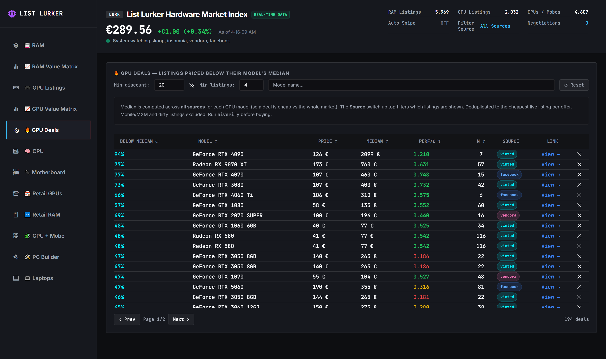
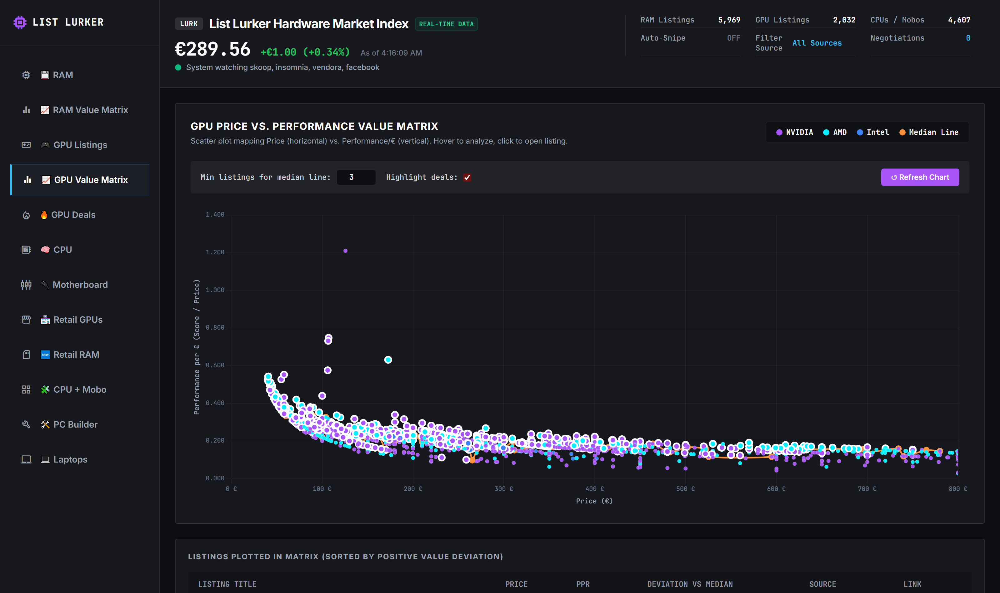
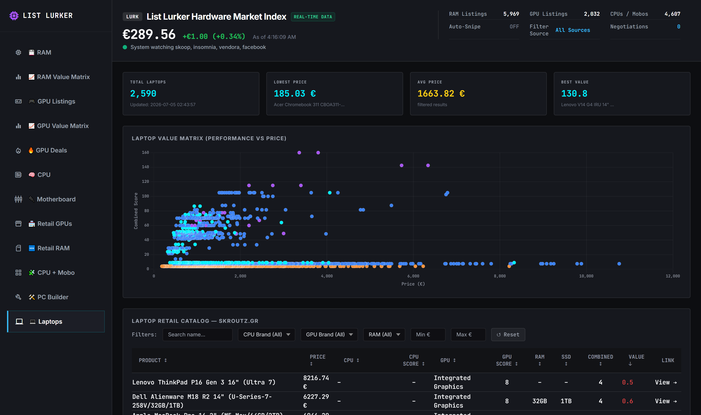
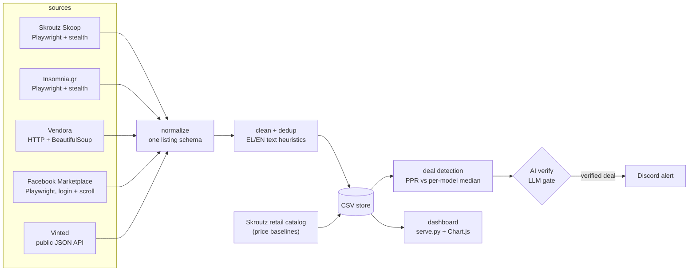

# List Lurker

[](https://github.com/AlexandrosLiamp/list-lurker/actions/workflows/ci.yml)

**Deal-hunting telemetry for the Greek second-hand PC-parts market.**
Crawls five marketplaces, normalizes messy mixed Greek/English listings into one schema,
scores every GPU against its live market median, has an LLM double-check each candidate
deal, and alerts Discord — with a browser dashboard for price analysis and PC-build planning.

**[▶ Live dashboard demo](https://alexandrosliamp.github.io/list-lurker/)** (static build with a July 2026 data snapshot)



## What it does

- **Watches 5 used-goods sources** — Skroutz Skoop, Insomnia.gr, Vendora, Facebook
  Marketplace, Vinted — plus the Skroutz retail catalog for price baselines.
- **Detects real deals, not just cheap listings**: each GPU is matched against a
  91-model performance database (`gpu_perf.py`), gets a price-to-performance ratio,
  and is compared to the *median market price of its exact model across all sources*.
- **AI verification gate** (`ai_verify.py`): before an alert fires, an LLM reads the
  listing page and rejects prebuilts, laptops, mobile variants and accessories that
  regex heuristics would misclassify — with tolerant parsing of imperfect model replies.
- **Alerts Discord** on verified deals; everything else is logged for the analytics
  dashboard and the PC-build helper.
- **~16,000 collected price points** ship as `sample_data/` so a fresh clone renders
  a fully working dashboard.

| GPU value matrix | Laptop value hunting |
|---|---|
|  |  |

## Architecture



All sources are normalized to one listing dict (`{name, condition, price, url}`), so
deal detection, storage and the dashboard are completely source-agnostic.

## Engineering highlights

- **Cloudflare-challenge crawling** — Skroutz sits behind a CF challenge; the crawler
  passes it headlessly via `playwright-stealth` fingerprint hardening plus quiet pacing
  and per-source backoff (see `monitor.py`, `fb_marketplace.py`).
- **A watchdog for hung browser calls** — Playwright's sync API can block forever on a
  wedged page. `monitor.py`'s `page_timeout` context manager arms a timer thread that
  injects a timeout exception into the *main* thread via
  `ctypes.pythonapi.PyThreadState_SetAsyncExc` — no orphaned crawls, no zombie runs.
- **Anti-bot economics on Facebook** — Marketplace soft-blocks fast crawlers, so the FB
  worker runs in its own thread with its own browser, seeds silently, scroll-crawls
  until it hits known listings, and backs off for a cooldown when it detects a block.
- **Mixed-language text normalization** — Greek sellers write "κάρτα γραφικών RTX 3080
  σκόνη/pet-free"; matching 91 GPU models inside that requires Unicode normalization,
  Greeklish-aware heuristics and blacklist filters rather than naive keyword search.
- **Tolerant LLM-output parsing** — the verify gate treats the model as an unreliable
  narrator: JSON extraction survives renamed keys, stray prose and partial replies,
  and the pipeline degrades to heuristics-only when no LLM is available.
- **Laptop spec mining** — `laptop_perf.py` parses CPU/GPU/RAM/SSD out of free-text
  retail titles and computes a combined value score, powering the laptop value matrix.

## Quickstart

```bash
git clone https://github.com/AlexandrosLiamp/list-lurker
cd list-lurker
pip install -r requirements.txt        # Python 3.10+
playwright install chromium

# demo: give the dashboard the bundled data snapshot, then serve it
cp sample_data/*.csv .
python serve.py                        # → http://localhost:8080/dashboard.html
```

Crawl real data and watch for deals:

```bash
python monitor.py crawl gpu            # quick GPU crawl of every source (early-stop)
python monitor.py crawl full           # full crawl of everything + retail baselines
python monitor.py watch                # seed, then poll forever + Discord alerts
```

Usage (`source` and `part` are optional and order-independent):

```
python monitor.py <command> [source] [part]
  commands : crawl | crawl full | watch | crawl skroutz | verify | aiverify | dedup
  source   : skoop | insomnia | vendora | facebook | vinted
  part     : ram | gpu | cpu | mobo | laptop | all
```

Or run it containerized (the image bases on the pinned Playwright build):

```bash
docker compose up                      # dashboard on :8080
docker compose --profile watch up      # + the crawl-and-alert loop
```

**Discord alerts**: set the `DISCORD_WEBHOOK` environment variable, or
`cp config.example.json config.json` and paste your webhook there. Without it the
monitor runs alert-less and just logs.

**AI verification** is optional: it activates automatically when a `claude` CLI is on
PATH (or a DeepSeek API key is configured) and self-disables otherwise.

**Facebook & Vinted** need one-time session setup on first use (interactive login /
token fetch); the other sources work immediately.

## Responsible use

This is a personal research/monitoring tool: it rate-limits itself, paces requests
quietly, respects login walls, stores only public listing data (title, condition,
price, URL) and no personal seller data, and is not used for resale or republication
of scraped content. Use it against your own accounts and at your own pace.

## Project layout

| File | Role |
|---|---|
| `monitor.py` | Orchestrator: CLI, crawl tiers, watch loop, deal detection, CSV logging |
| `fb_marketplace.py` | Facebook Marketplace crawler (login, scroll, block backoff) |
| `vinted.py` / `vendora_crawler.py` | Vinted JSON-API and Vendora HTML crawlers |
| `gpu_perf.py` | 91-model GPU performance database + matching |
| `laptop_perf.py` | Laptop spec parsing + combined value scoring |
| `ram_specs.py` + `ram_kits.json` | RAM title parsing (kit-aware) + spec sanity flags vs. real-kit ground truth |
| `ai_verify.py` | LLM verification gate (Claude CLI / DeepSeek API) |
| `serve.py` + `dashboard.html` | Local server + single-page analytics dashboard (Chart.js) |
| `applog.py` / `reports.py` / `archive_store.py` | Logging, listing reports, archive-and-purge |

## Open core

`serve.py` and `monitor.py` reference an optional offer-negotiation subsystem that is
not part of this repo — it automates personal marketplace conversations, so it stays
private. The public code is designed to degrade cleanly without it: negotiator-only API
endpoints answer `501`, the dashboard hides its Negotiations tab, and everything
described above runs self-contained.

## Acknowledgements

- RAM listings are sanity-checked against ground truth derived from
  [pc-part-dataset](https://github.com/docyx/pc-part-dataset) (MIT) — 13.5k real
  memory kits distilled into `ram_kits.json` (see `ram_specs.py`).

## License

MIT — see [LICENSE](LICENSE).
